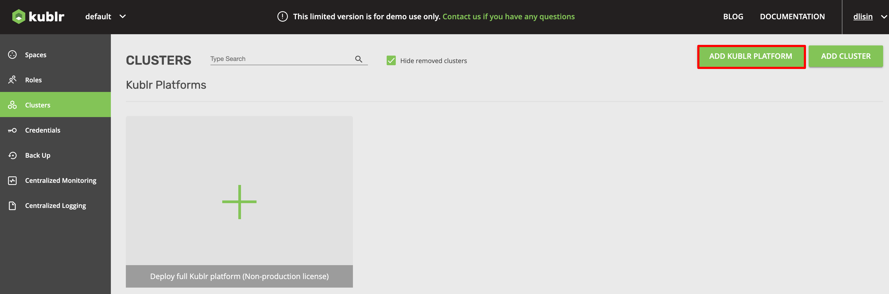
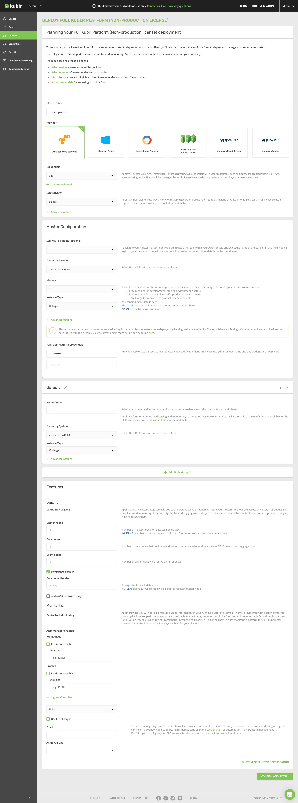
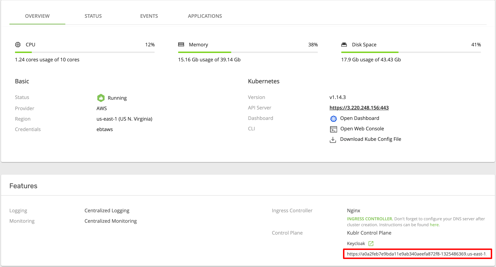
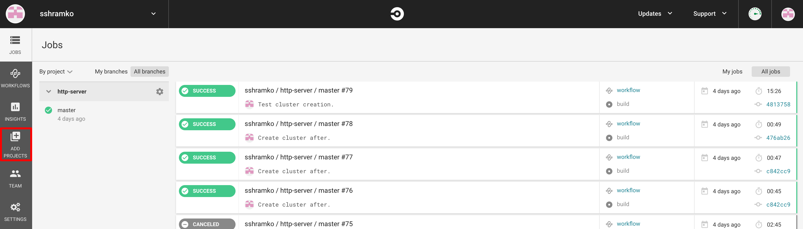
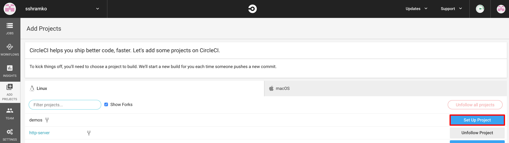
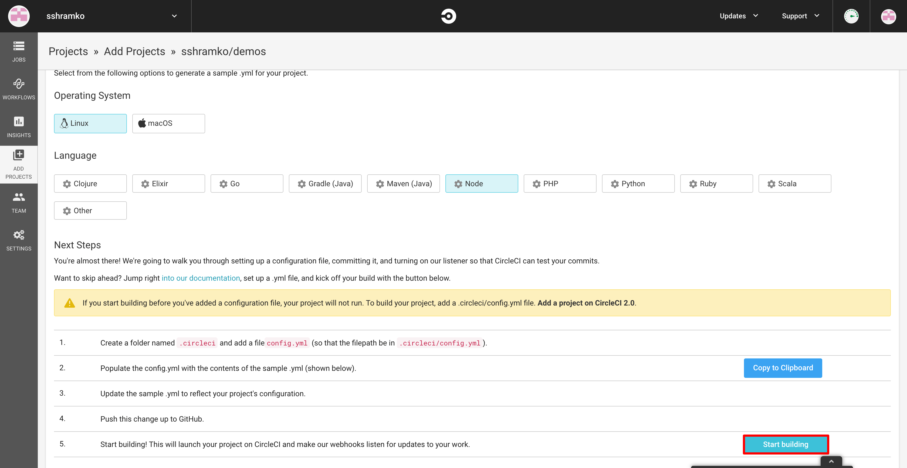
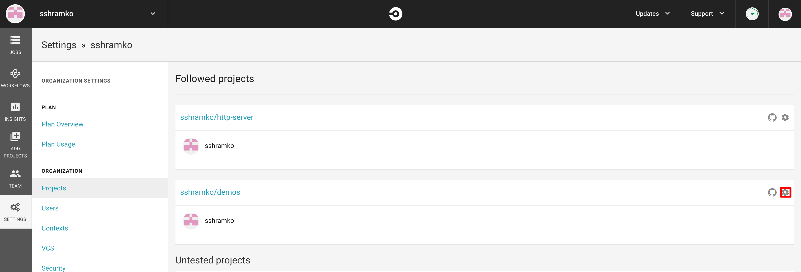
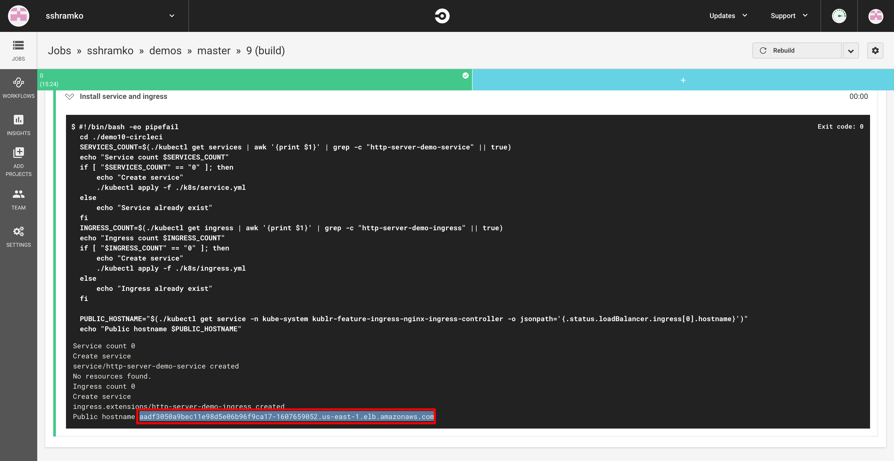

# Http server circleci deployment

For running this demo you need
- Docker
- AWS account
- Github account (github.com)
- Dockerhub account (dockerhub.com)
- Circleci account that attached to github account (circleci.com)

## Kublr cluster creation
1. Register on kublr.com site and get evaluation version of kublr docker image

1. Run kublr docker image  
``
sudo docker run --name kublr -d --restart=unless-stopped -p 9080:9080 -e KUBLR_LICENSE=<license key> kublr/kublr:1.12
``

1. Open localhost:9080 and login using 
    - user: admin 
    - password: kublrbox
   Select "Clusters" section and click "Add kublr platform"
   
1. Specify 
    - cluster name: circleci-kublr-platform
    - AWS credentials: your access key and secret key
    - operation system : aws-ubuntu-16.04
    - masters: 1
    - Instance Type: t2.large
    - Full Kublr Platform Credentials: Create you password
    - Nodes Count: 2
    - Operating System: aws-ubuntu-16.04
    - Instance Type: t2.xlarge
    - Confirm and install
    
1. Wait while cluster will be created.
1. Open cluster information and open link in Feature -> Control Plane section 

Save this link for feature
1. Login to new created platform, go to Credentials section and create a new one:
    - name: awscirclecicred
    - Access key: your access key
    - Secret key: your secret key

## Setup circleci
1. Create repository in dockerhub.
In this example it is kublr/demo-circleci

1. Clone demo project repository on github.

1. Go to https://circleci.com/dashboard and add a new project. 

    Select cloned project from list.
    - Operating System: linux
    - Language: Node

1. Clisck "Start build"

    
1. Open project settings -> Environment Variables ( in BUILD SETTINGS section)
    - DOCKERHUB_USERNAME: Dockehub username
    - DOCKERHUB_PASS:	Dockerhub password
    - IMAGE_NAME: You docker repository name (like kublr/demo-circleci)
    - KUBLR_ENDPOINT: Url to kublr platform without '/' (https://a0a2feb7e9bda11e9ab340aeefa872f8-1325486369.us-east-1.elb.amazonaws.com)
    - KUBLR_USERNAME: Kublr platform username
    - KUBLR_PASSWORD: Kublr platform password

    
1. Open circleci jobs page and run build job.
1. Wait while job will finish and open it, in the last step logs you can find public hostname for project deployment.

Copy url to the buffer.

1. Wait 5-10 min while amazon updating DNS.
 
1. Open url in browser and get:

                             
 

