# Spark, Jupyter Notebook, And HDFS On Kubernetes

## Motivation

Spark, Jupyter Notebook, and HDFS are very popular tools in the data science community.
HDFS carries the burden of storing big data,
Spark provides many powerful tools to process them,
while Jupyter Notebook is a de-facto standard UI to manage them all.

On the other hand, Kubernetes and Kublr make it simple and easy to deploy,
scale, and otherwise manage everything.
This guide explains how to do it.

## Features

- Jupyter Notebook with Spark 2.4.0 (Hadoop 2.6) and Python 3.6
  - PySpark is already installed
  - Notebooks are persistent
- HDFS (optional)
  - Default installation includes:
    - 2 namenodes, 1 active and 1 standby, with 100 GB volume each
    - 4 datanodes
    - 3 journalnodes with 20 GB volume each
    - 3 zookeeper servers (to make sure only one namenode is active) with 5 GB volume each
    - an HDFS client pod
  - Persistent data
  - Reliability: even if all pods fail, they are recovered automatically, and previously stored data is available. However, transparent failover during working with HDFS from Jupyter Notebook is not guaranteed, at least because active and standby name nodes can swap.
- Spark 2.4.0 (Hadoop 2.6)
  - Kubernetes creates as many workers as the user requests creating a `pyspark.SparkContext` in Jupyter Notebook
  - Kubernetes deletes workers automatically when the user stops the `pyspark.SparkContext` or the Python3 kernel in Jupyter Notebook
  - Kubernetes restores failed workers automatically, even during calculations. A restored worker picks up and completes the work interrupted by the failure, so the failover is transparent to users.
  - Multi-user work is supported: each user can create their own independent workers
  - Data locality: data processing is performed in such a way that the data stored on and HDFS node is processed by Spark workers executing on the same Kubernetes node (if any), which leads to significantly reduced network usage and better performance
- Auto-scaling Kubernetes cluster (optional)
  - Automatic creation of more Kubernetes nodes when there are no enough resources for spark workers
  - Automatic down-scaling when the load is low to decrease costs

## Preparing Docker Images for Jupyter Notebook and Spark Workers

We have already prepared all necessary images for you to use.
If you would like to prepare your own, read on.

We assume that you've cloned this repository,
and your current working directory is `demo9-jupyter-pyspark`
(the one this `README.md` is in).
 
First, we have to download and unpack the Spark distribution:

```bash
wget http://archive.apache.org/dist/spark/spark-2.4.0/spark-2.4.0-bin-hadoop2.6.tgz
tar xvzf spark-2.4.0-bin-hadoop2.6.tgz
rm spark-2.4.0-bin-hadoop2.6.tgz
```

For the convenience, let's create symlink `spark` to the distro:

```bash
ln -s spark-2.4.0-bin-hadoop2.6 spark
```

Build Docker image `kublr/spark-py:2.4.0-hadoop-2.6` with Spark and Python.
Hereafter, replace `kublr` by your Docker Hub account name.

```bash
(cd spark && bin/docker-image-tool.sh -r docker.io/kublr -t 2.4.0-hadoop-2.6 build)
```

Push the image to the Docker Hub so K8S will be able to create worker pods from it.
You will likely have to call `docker login` at first.

```bash
docker push kublr/spark-py:2.4.0-hadoop-2.6
```

Build and push the image with Jupyter Notebook:

```bash
docker build -t kublr/pyspark-notebook:spark-2.4.0-hadoop-2.6 -f jupyter/Dockerfile .
docker push kublr/pyspark-notebook:spark-2.4.0-hadoop-2.6
```

## Creating a K8S Cluster Using Kublr

Here we've used [Amazon Web Services(AWS)](https://aws.amazon.com/) as a cloud in which our cluster will run,
but you will need to choose the appropriate one for your, or even run it on your own servers.

To manage necessary AWS resources, such as EC2 Instances, Elastic Load Balancers, etc., proper AWS credentials are required.

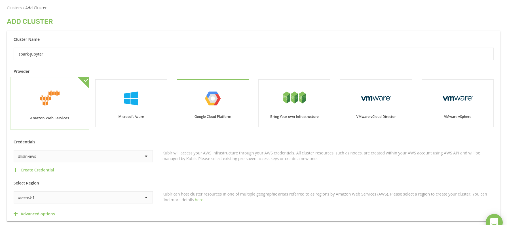

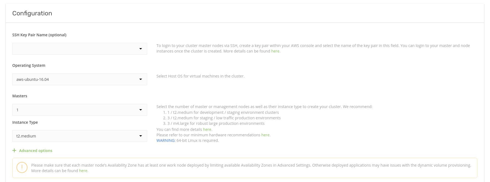

Let's also enable auto-scaling

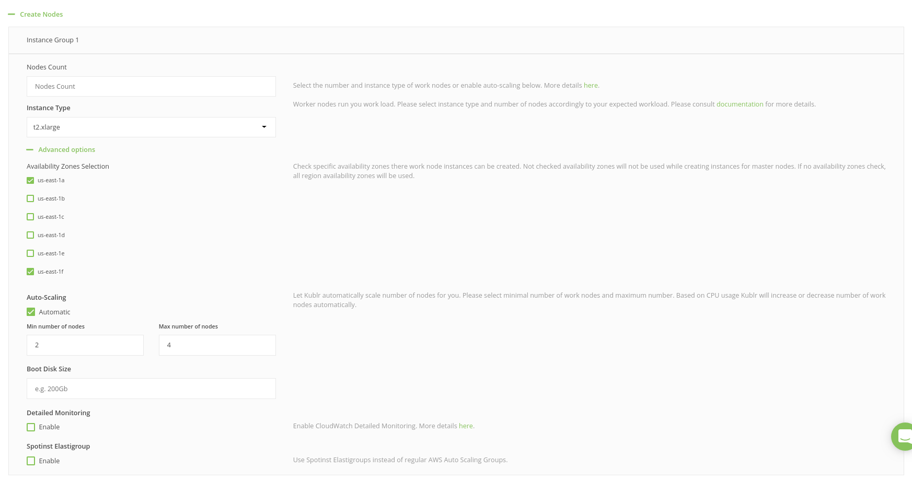

An ingress controller is required to expose Jupyter Notebook to the Internet.
To configure HTTPS properly, select `Use Let's Encrypt` and provide proper parameters.
Otherwise (as shown at the screenshot below) a self-signed SSL certificate will be used,
and web browsers will complain. 

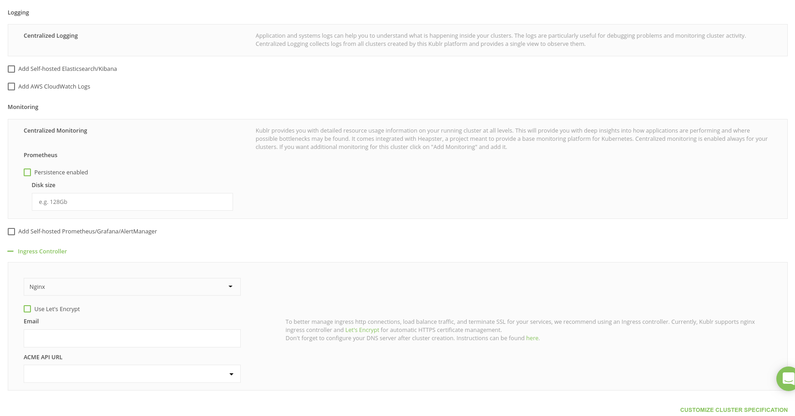

The creation may take 15 minutes or so.
When the cluster is up and running, the Kublr dashboard looks like this:

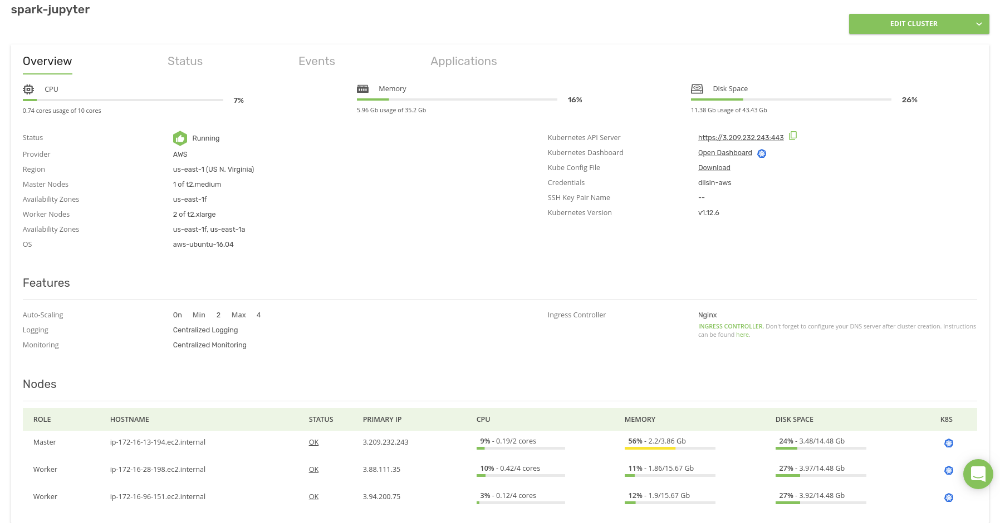

Note that the cluster contains `2` worker nodes, the minimum number we specified in auto-scaling settings.

To use `kubectl` and `helm` with the new cluster, it's required to download `Kube Config File` as `~/.kube/config`.

Finally, let's open the Kubernetes Dashboard. Click `Open Dashboard`.

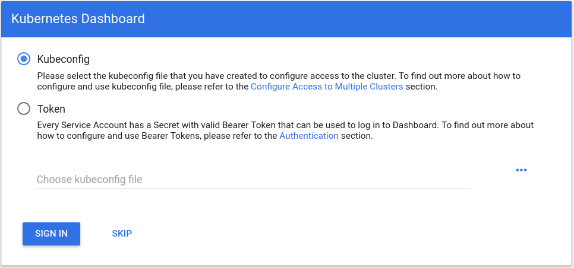

Authentication is required.
Get a token from the downloaded `~/.kube/config`:

```bash
cat ~/.kube/config | grep token
```

This command prints something like

```
- name: spark-jupyter-admin-token
    token: xxxxxxxxxxxxxxxxxxxxxxxxxxxxxxxx
```

That `xxxxxxxxxxxxxxxxxxxxxxxxxxxxxxxx` is what we need.
Copy-paste it into the form:

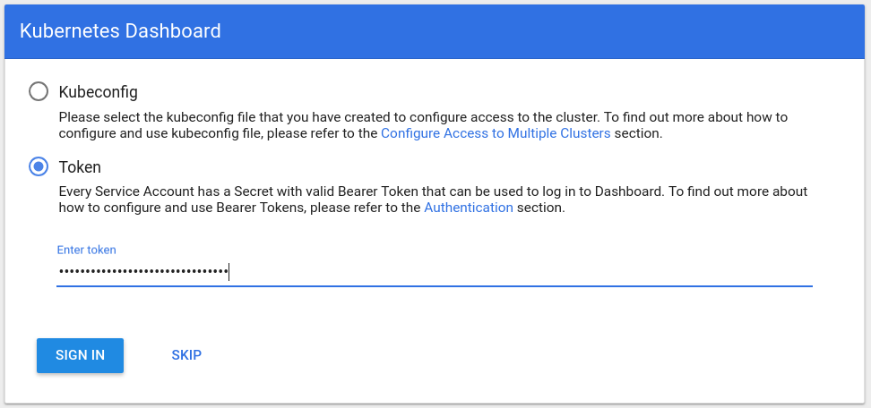

Alternatively, if you're OK with using the Kubernetes Dashboard in the read-only mode, click `SKIP`.

## Installing Jupyter Notebook

We assume that you've cloned this repository,
and your current working directory is `demo9-jupyter-pyspark`
(the one this `README.md` is in).

Install Jupyter Notebook as a chart (`my-pyspark-notebook` is an example name of this chart "instance"):

```bash
helm install -n my-pyspark-notebook charts/pyspark-notebook
```

It is OK if the Kubernetes dashboard shows an error like:

```
pod has unbound immediate PersistentVolumeClaims (repeated 2 times)
AttachVolume.Attach failed for volume "pvc-82ebda50-6a58-11e9-80e4-02a82483ac0c" : "Error attaching EBS volume \"vol-02b63505fb00f7240\"" to instance "i-02b46ac14d1808b6d" since volume is in "creating" state
```

It usually disappears in a minute, when a volume for notebooks is created.

## Associating Your Domain with the Ingress Hostname

Obtain the ingress controller hostname:

```bash
kubectl get service -n kube-system kublr-ingress-nginx-ingress-controller -o 'jsonpath={.status.loadBalancer.ingress[0].hostname}'
```

In case of AWS, it should print something like `aa5e1e16a543111e9ae3d0e6004935f1-473611111.us-east-1.elb.amazonaws.com`.

Configure your domain so that it points to that hostname.

## Opening Jupyter Notebook

Store the domain name in `K8S_DOMAIN` environment variable
and use it to construct the Jupyter URL:

```bash
kubectl exec $(kubectl get pods -l app.kubernetes.io/instance=my-pyspark-notebook -o go-template --template '{{(index .items 0).metadata.name}}') jupyter notebook list \
    | grep 'http://0.0.0.0:8888/' \
    | awk '{print $1}' \
    | sed "s|http://0.0.0.0:8888|https://$K8S_DOMAIN|"
```

Open this URL in a web browser,
however wait a few minutes before opening the Jupyter Notebook for the first time to avoid possible DNS-caching issues.

## Doing Some Work

Create a Python 3 notebook:

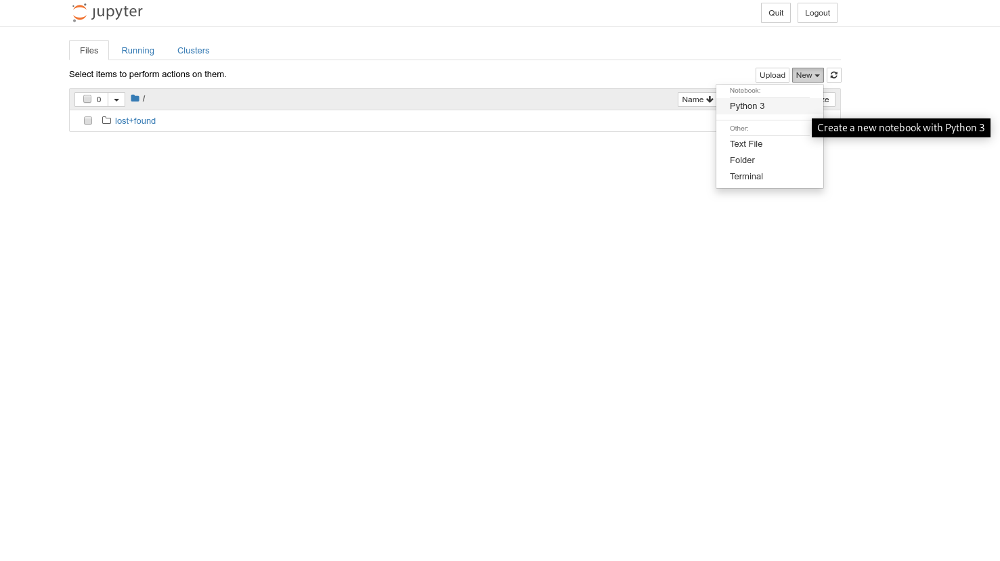

Create a Spark context (pay attention to code comments):

```python
import pyspark
conf = pyspark.SparkConf()
conf.setMaster("k8s://https://kubernetes.default.svc.cluster.local:443") # K8S is a Spark master. It creates pods with Spark workers, orchestrates those workers and returns final results to the Spark driver.
conf.set("spark.kubernetes.container.image", "kublr/spark-py:2.4.0-hadoop-2.6") # Worker pods are created from this docker image. If you use another image, specify it instead.

# Authentication (required to create worker pods):
conf.set("spark.kubernetes.authenticate.caCertFile", "/var/run/secrets/kubernetes.io/serviceaccount/ca.crt")
conf.set("spark.kubernetes.authenticate.oauthTokenFile", "/var/run/secrets/kubernetes.io/serviceaccount/token")
conf.set("spark.kubernetes.authenticate.driver.serviceAccountName", "my-pyspark-notebook") # replace `my-pyspark-notebook` by the actual name of the Jupyter release

conf.set("spark.executor.instances", "2") # 2 pods/workers will be created. Customize it if necessary.
conf.set("spark.driver.host", "my-pyspark-notebook-spark-driver.default.svc.cluster.local") # this is where the DNS alias for the Spark driver come in handy. Replace `my-pyspark-notebook` by the actual name of the Jupyter release
conf.set("spark.driver.port", "29413") # You are free to use another number. If this port is busy, spark-shell tries to bind to another port.
sc = pyspark.SparkContext(conf=conf)
```

As a result, 2 pods/workers should be created:

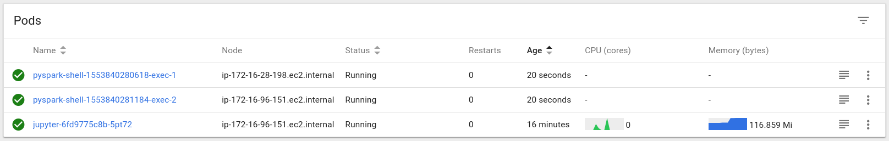

The first time you do this, the worker pod creation may take a bit of time as Kubernetes downloads the Docker image.

Calculate something on the Spark cluster:

```python
rdd = sc.parallelize(range(100000000))
rdd.sum()
```

It should return `4999999950000000`.

We can make sure, by Spark worker pod logs, that all pods participated in the calculation:

`pyspark-shell-1553840280618-exec-1`:

```
2019-03-29 06:21:38 INFO  CoarseGrainedExecutorBackend:54 - Got assigned task 0
2019-03-29 06:21:38 INFO  Executor:54 - Running task 0.0 in stage 0.0 (TID 0)
2019-03-29 06:21:38 INFO  TorrentBroadcast:54 - Started reading broadcast variable 0
2019-03-29 06:21:38 INFO  TransportClientFactory:267 - Successfully created connection to my-pyspark-notebook-spark-driver.default.svc.cluster.local/100.96.0.10:40161 after 2 ms (0 ms spent in bootstraps)
2019-03-29 06:21:38 INFO  MemoryStore:54 - Block broadcast_0_piece0 stored as bytes in memory (estimated size 3.9 KB, free 413.9 MB)
2019-03-29 06:21:38 INFO  TorrentBroadcast:54 - Reading broadcast variable 0 took 119 ms
2019-03-29 06:21:38 INFO  MemoryStore:54 - Block broadcast_0 stored as values in memory (estimated size 5.7 KB, free 413.9 MB)
2019-03-29 06:21:40 INFO  PythonRunner:54 - Times: total = 2137, boot = 452, init = 51, finish = 1634
2019-03-29 06:21:40 INFO  Executor:54 - Finished task 0.0 in stage 0.0 (TID 0). 1468 bytes result sent to driver
```

`pyspark-shell-1553840281184-exec-2`:

```
2019-03-29 06:21:38 INFO  CoarseGrainedExecutorBackend:54 - Got assigned task 1
2019-03-29 06:21:38 INFO  Executor:54 - Running task 1.0 in stage 0.0 (TID 1)
2019-03-29 06:21:38 INFO  TorrentBroadcast:54 - Started reading broadcast variable 0
2019-03-29 06:21:38 INFO  TransportClientFactory:267 - Successfully created connection to my-pyspark-notebook-spark-driver.default.svc.cluster.local/100.96.0.10:40161 after 1 ms (0 ms spent in bootstraps)
2019-03-29 06:21:38 INFO  MemoryStore:54 - Block broadcast_0_piece0 stored as bytes in memory (estimated size 3.9 KB, free 413.9 MB)
2019-03-29 06:21:38 INFO  TorrentBroadcast:54 - Reading broadcast variable 0 took 115 ms
2019-03-29 06:21:38 INFO  MemoryStore:54 - Block broadcast_0 stored as values in memory (estimated size 5.7 KB, free 413.9 MB)
2019-03-29 06:21:40 INFO  PythonRunner:54 - Times: total = 2108, boot = 433, init = 52, finish = 1623
2019-03-29 06:21:40 INFO  Executor:54 - Finished task 1.0 in stage 0.0 (TID 1). 1425 bytes result sent to driver
```

In the end, it's a good practice to clean up the resources:

```python
sc.stop()
```

This command deletes the worker pods with the same effect as shutting down the notebook kernel.

## HDFS (Optional)

[HDFS on Kubernetes](https://github.com/apache-spark-on-k8s/kubernetes-HDFS) project contains a ready-to-use Helm chart to deploy HDFS on a Kubernetes cluster.

Default setup includes:
- 2 namenodes, 1 active and 1 standby, with 100 GB volume each
- 4 datanodes
- 3 journalnodes with 20 GB volume each
- 3 zookeeper servers (to make sure only one namenode is active) with 5 GB volume each
- HDFS client pod

To deploy HDFS, let's first clone that repo and go to the directory:

```bash
git clone https://github.com/apache-spark-on-k8s/kubernetes-HDFS.git
cd kubernetes-HDFS
```

To get access to HDFS Web UI later,
you're required to edit properties `dfs.namenode.http-address.hdfs-k8s.nn0` and `dfs.namenode.http-address.hdfs-k8s.nn1`
in `charts/hdfs-config-k8s/templates/configmap.yaml`:

```xml
<property>
    <name>dfs.namenode.http-address.hdfs-k8s.nn0</name>
    <value>0.0.0.0:50070</value>
</property>
<property>
    <name>dfs.namenode.http-address.hdfs-k8s.nn1</name>
    <value>0.0.0.0:50070</value>
</property>
```

Here we duplicate required commands to set up HDFS, but they may become outdated.
See [the origin](https://github.com/apache-spark-on-k8s/kubernetes-HDFS/blob/master/charts/README.md#basic) for the latest version.

```bash
helm repo add incubator  \
      https://kubernetes-charts-incubator.storage.googleapis.com/
helm dependency build charts/hdfs-k8s
helm install -n my-hdfs charts/hdfs-k8s
```

We use default release name `my-hdfs`.
If you use another name, substitute it instead of `my-hdfs`
when following this guide chapter.

In the end, some pods and other resources are created.
This may take some minutes due to temporary errors like `pod has unbound immediate PersistentVolumeClaims` and/or auto-scaling.

To open access to HDFS Web UI, start port forwarding:

```bash
kubectl port-forward service/my-hdfs-namenode 50070:50070
```

Then the UI is available at `http://localhost:50070`.

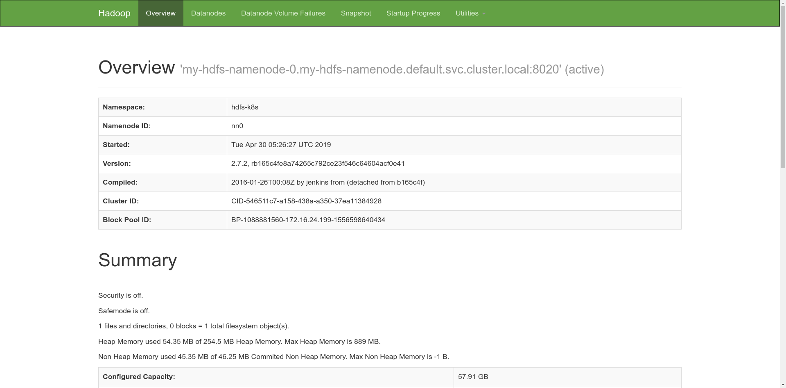

Create a Spark session:

```python
from pyspark.sql import SparkSession
sparkSession = SparkSession.builder \
    .master("k8s://https://kubernetes.default.svc.cluster.local:443") \
    .config("spark.kubernetes.container.image", "kublr/spark-py:2.4.0-hadoop-2.6") \
    .config("spark.kubernetes.authenticate.caCertFile", "/var/run/secrets/kubernetes.io/serviceaccount/ca.crt") \
    .config("spark.kubernetes.authenticate.oauthTokenFile", "/var/run/secrets/kubernetes.io/serviceaccount/token") \
    .config("spark.kubernetes.authenticate.driver.serviceAccountName", "my-pyspark-notebook") \
    .config("spark.executor.instances", "2") \
    .config("spark.driver.host", "my-pyspark-notebook-spark-driver.default.svc.cluster.local") \
    .config("spark.driver.port", "29413") \
    .getOrCreate()
sc = sparkSession.sparkContext
```

Describe some data:

```python
df = sparkSession.createDataFrame(sc.parallelize(range(10000000)).map(lambda i: ((i, i * 2))))
```

Hereafter, we will execute HDFS commands from a dedicated pod created by `helm install` along with others.
Here we obtain its name:

```bash
_CLIENT=$(kubectl get pods -l app=hdfs-client,release=my-hdfs -o name |  \
      cut -d/ -f 2)
```

If you've deployed HDFS as described above, there should be two name nodes.
Let's check them:

```bash
kubectl exec $_CLIENT -- hdfs haadmin -getServiceState nn0
```

It prints `active`.
Well, how about another?

```bash
kubectl exec $_CLIENT -- hdfs haadmin -getServiceState nn1
```

Output: `standby`.

We have one master and one replica.
Let's save our data as a CSV file on HDFS.
Use the hostname of master to do it, because nodes in standby mode cannot accept write requests.

```python
df.write.csv("hdfs://my-hdfs-namenode-0.my-hdfs-namenode.default.svc.cluster.local/user/hdfs/test/example.csv")
```

We can make sure that all pods participated in the calculation and writing by checking Spark worker pod logs:

`pyspark-shell-1554099778487-exec-1`:

```
2019-04-01 06:25:27 INFO  CoarseGrainedExecutorBackend:54 - Got assigned task 2
2019-04-01 06:25:27 INFO  Executor:54 - Running task 1.0 in stage 1.0 (TID 2)
2019-04-01 06:25:27 INFO  TorrentBroadcast:54 - Started reading broadcast variable 1
2019-04-01 06:25:27 INFO  MemoryStore:54 - Block broadcast_1_piece0 stored as bytes in memory (estimated size 53.4 KB, free 413.9 MB)
2019-04-01 06:25:27 INFO  TorrentBroadcast:54 - Reading broadcast variable 1 took 18 ms
2019-04-01 06:25:27 INFO  MemoryStore:54 - Block broadcast_1 stored as values in memory (estimated size 141.1 KB, free 413.7 MB)
2019-04-01 06:25:28 INFO  CodeGenerator:54 - Code generated in 214.957469 ms
2019-04-01 06:25:28 INFO  SQLHadoopMapReduceCommitProtocol:54 - Using output committer class org.apache.hadoop.mapreduce.lib.output.FileOutputCommitter
2019-04-01 06:25:46 INFO  PythonRunner:54 - Times: total = 19412, boot = 8, init = 42, finish = 19362
2019-04-01 06:25:47 INFO  FileOutputCommitter:439 - Saved output of task 'attempt_20190401062528_0001_m_000001_0' to hdfs://my-hdfs-namenode-0.my-hdfs-namenode.default.svc.cluster.local/user/hdfs/test/example.csv/_temporary/0/task_20190401062528_0001_m_000001
2019-04-01 06:25:47 INFO  SparkHadoopMapRedUtil:54 - attempt_20190401062528_0001_m_000001_0: Committed
2019-04-01 06:25:47 INFO  Executor:54 - Finished task 1.0 in stage 1.0 (TID 2). 2727 bytes result sent to driver
```

`pyspark-shell-1554099779266-exec-2`:

```
2019-04-01 06:25:27 INFO  CoarseGrainedExecutorBackend:54 - Got assigned task 1
2019-04-01 06:25:27 INFO  Executor:54 - Running task 0.0 in stage 1.0 (TID 1)
2019-04-01 06:25:27 INFO  TorrentBroadcast:54 - Started reading broadcast variable 1
2019-04-01 06:25:27 INFO  TransportClientFactory:267 - Successfully created connection to /100.96.3.8:35072 after 2 ms (0 ms spent in bootstraps)
2019-04-01 06:25:27 INFO  MemoryStore:54 - Block broadcast_1_piece0 stored as bytes in memory (estimated size 53.4 KB, free 413.9 MB)
2019-04-01 06:25:27 INFO  TorrentBroadcast:54 - Reading broadcast variable 1 took 127 ms
2019-04-01 06:25:27 INFO  MemoryStore:54 - Block broadcast_1 stored as values in memory (estimated size 141.1 KB, free 413.7 MB)
2019-04-01 06:25:28 INFO  CodeGenerator:54 - Code generated in 291.154539 ms
2019-04-01 06:25:29 INFO  SQLHadoopMapReduceCommitProtocol:54 - Using output committer class org.apache.hadoop.mapreduce.lib.output.FileOutputCommitter
2019-04-01 06:25:47 INFO  PythonRunner:54 - Times: total = 19679, boot = 411, init = 52, finish = 19216
2019-04-01 06:25:47 INFO  FileOutputCommitter:439 - Saved output of task 'attempt_20190401062528_0001_m_000000_0' to hdfs://my-hdfs-namenode-0.my-hdfs-namenode.default.svc.cluster.local/user/hdfs/test/example.csv/_temporary/0/task_20190401062528_0001_m_000000
2019-04-01 06:25:47 INFO  SparkHadoopMapRedUtil:54 - attempt_20190401062528_0001_m_000000_0: Committed
2019-04-01 06:25:47 INFO  Executor:54 - Finished task 0.0 in stage 1.0 (TID 1). 2727 bytes result sent to driver
```

Let's review the file in HDFS:

```bash
kubectl exec $_CLIENT -- hdfs dfs -ls /user/hdfs/test/example.csv
```

It should print something like

```
Found 3 items
-rw-r--r--   3 root supergroup          0 2019-04-01 06:25 /user/hdfs/test/example.csv/_SUCCESS
-rw-r--r--   3 root supergroup   78333335 2019-04-01 06:25 /user/hdfs/test/example.csv/part-00000-8de1982a-d9f9-4632-82bc-2f623b6b51ca-c000.csv
-rw-r--r--   3 root supergroup   85000000 2019-04-01 06:25 /user/hdfs/test/example.csv/part-00001-8de1982a-d9f9-4632-82bc-2f623b6b51ca-c000.csv
```

As we can see, it consists of two parts, one for each Spark worker.

Now let's read the file:

```python
sparkSession.read.csv("hdfs://my-hdfs-namenode-0.my-hdfs-namenode.default.svc.cluster.local/user/hdfs/test/example.csv").count() # should print 10000000
```

Reading is performed on both Spark pods:

`pyspark-shell-1554099778487-exec-1`:

```
019-04-01 08:37:41 INFO  CoarseGrainedExecutorBackend:54 - Got assigned task 4
2019-04-01 08:37:41 INFO  Executor:54 - Running task 0.0 in stage 3.0 (TID 4)
2019-04-01 08:37:41 INFO  TorrentBroadcast:54 - Started reading broadcast variable 6
2019-04-01 08:37:41 INFO  TransportClientFactory:267 - Successfully created connection to /100.96.2.12:32964 after 2 ms (0 ms spent in bootstraps)
2019-04-01 08:37:41 INFO  MemoryStore:54 - Block broadcast_6_piece0 stored as bytes in memory (estimated size 6.5 KB, free 413.9 MB)
2019-04-01 08:37:41 INFO  TorrentBroadcast:54 - Reading broadcast variable 6 took 55 ms
2019-04-01 08:37:41 INFO  MemoryStore:54 - Block broadcast_6 stored as values in memory (estimated size 12.3 KB, free 413.9 MB)
2019-04-01 08:37:41 INFO  CodeGenerator:54 - Code generated in 22.953308 ms
2019-04-01 08:37:41 INFO  FileScanRDD:54 - Reading File path: hdfs://my-hdfs-namenode-0.my-hdfs-namenode.default.svc.cluster.local/user/hdfs/test/example.csv/part-00001-8de1982a-d9f9-4632-82bc-2f623b6b51ca-c000.csv, range: 0-85000000, partition values: [empty row]
2019-04-01 08:37:41 INFO  CodeGenerator:54 - Code generated in 6.817728 ms
2019-04-01 08:37:41 INFO  TorrentBroadcast:54 - Started reading broadcast variable 5
2019-04-01 08:37:41 INFO  MemoryStore:54 - Block broadcast_5_piece0 stored as bytes in memory (estimated size 20.9 KB, free 413.9 MB)
2019-04-01 08:37:41 INFO  TorrentBroadcast:54 - Reading broadcast variable 5 took 9 ms
2019-04-01 08:37:41 INFO  MemoryStore:54 - Block broadcast_5 stored as values in memory (estimated size 296.3 KB, free 413.6 MB)
2019-04-01 08:37:42 INFO  Executor:54 - Finished task 0.0 in stage 3.0 (TID 4). 1624 bytes result sent to driver
```

`pyspark-shell-1554099779266-exec-2`:

```
2019-04-01 08:37:41 INFO  Executor:54 - Running task 1.0 in stage 3.0 (TID 5)
2019-04-01 08:37:41 INFO  TorrentBroadcast:54 - Started reading broadcast variable 6
2019-04-01 08:37:41 INFO  MemoryStore:54 - Block broadcast_6_piece0 stored as bytes in memory (estimated size 6.5 KB, free 413.9 MB)
2019-04-01 08:37:41 INFO  TorrentBroadcast:54 - Reading broadcast variable 6 took 7 ms
2019-04-01 08:37:41 INFO  MemoryStore:54 - Block broadcast_6 stored as values in memory (estimated size 12.3 KB, free 413.9 MB)
2019-04-01 08:37:41 INFO  CodeGenerator:54 - Code generated in 20.519085 ms
2019-04-01 08:37:41 INFO  FileScanRDD:54 - Reading File path: hdfs://my-hdfs-namenode-0.my-hdfs-namenode.default.svc.cluster.local/user/hdfs/test/example.csv/part-00000-8de1982a-d9f9-4632-82bc-2f623b6b51ca-c000.csv, range: 0-78333335, partition values: [empty row]
2019-04-01 08:37:41 INFO  CodeGenerator:54 - Code generated in 14.180708 ms
2019-04-01 08:37:41 INFO  TorrentBroadcast:54 - Started reading broadcast variable 5
2019-04-01 08:37:41 INFO  MemoryStore:54 - Block broadcast_5_piece0 stored as bytes in memory (estimated size 20.9 KB, free 413.9 MB)
2019-04-01 08:37:41 INFO  TorrentBroadcast:54 - Reading broadcast variable 5 took 20 ms
2019-04-01 08:37:41 INFO  MemoryStore:54 - Block broadcast_5 stored as values in memory (estimated size 296.3 KB, free 413.6 MB)
2019-04-01 08:37:42 INFO  Executor:54 - Finished task 1.0 in stage 3.0 (TID 5). 1668 bytes result sent to driver
```

## Opening Access to the Spark UI (Optional)

You created a Spark context and thus Spark workers:

```python
import pyspark
conf = pyspark.SparkConf()
conf.setMaster("k8s://https://kubernetes.default.svc.cluster.local:443")
conf.set("spark.kubernetes.container.image", "kublr/spark-py:2.4.0-hadoop-2.6")

conf.set("spark.kubernetes.authenticate.caCertFile", "/var/run/secrets/kubernetes.io/serviceaccount/ca.crt")
conf.set("spark.kubernetes.authenticate.oauthTokenFile", "/var/run/secrets/kubernetes.io/serviceaccount/token")
conf.set("spark.kubernetes.authenticate.driver.serviceAccountName", "my-pyspark-notebook")

conf.set("spark.executor.instances", "2")
conf.set("spark.driver.host", "my-pyspark-notebook-spark-driver.default.svc.cluster.local")
conf.set("spark.driver.port", "29413")
sc = pyspark.SparkContext(conf=conf)
```

To open access to the Spark UI, start Kubernetes Proxy in your terminal:

```bash
kubectl proxy
```

and then observe Spark at http://localhost:8001/api/v1/namespaces/default/services/my-pyspark-notebook-spark-ui:4040/proxy/ (replace `my-pyspark-notebook` by the actual name of the Jupyter release).

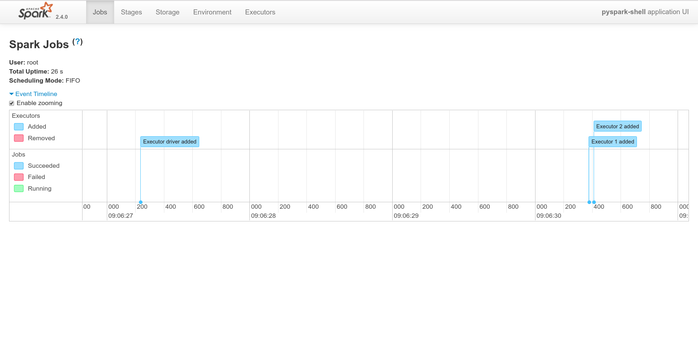

## Resource Requests and Limits Of Spark Worker Pods (Optional)

Requests and limits of memory and CPU are set on the Spark context creation and cannot be modified later.
By default, they are set to `1408Mi` and `1` CPU respectively.

To customize CPU limit, set `spark.kubernetes.executor.limit.cores`:

```python
import pyspark
conf = pyspark.SparkConf()
conf.setMaster("k8s://https://kubernetes.default.svc.cluster.local:443")
conf.set("spark.kubernetes.container.image", "kublr/spark-py:2.4.0-hadoop-2.6")

conf.set("spark.kubernetes.authenticate.caCertFile", "/var/run/secrets/kubernetes.io/serviceaccount/ca.crt")
conf.set("spark.kubernetes.authenticate.oauthTokenFile", "/var/run/secrets/kubernetes.io/serviceaccount/token")
conf.set("spark.kubernetes.authenticate.driver.serviceAccountName", "my-pyspark-notebook")

conf.set("spark.executor.instances", "2")
conf.set("spark.driver.host", "my-pyspark-notebook-spark-driver.default.svc.cluster.local")
conf.set("spark.driver.port", "29413")
conf.set("spark.kubernetes.executor.limit.cores", "2")
sc = pyspark.SparkContext(conf=conf)
```

To customize CPU request, set `spark.kubernetes.executor.request.cores`:

```python
import pyspark
conf = pyspark.SparkConf()
conf.setMaster("k8s://https://kubernetes.default.svc.cluster.local:443")
conf.set("spark.kubernetes.container.image", "kublr/spark-py:2.4.0-hadoop-2.6")

conf.set("spark.kubernetes.authenticate.caCertFile", "/var/run/secrets/kubernetes.io/serviceaccount/ca.crt")
conf.set("spark.kubernetes.authenticate.oauthTokenFile", "/var/run/secrets/kubernetes.io/serviceaccount/token")
conf.set("spark.kubernetes.authenticate.driver.serviceAccountName", "my-pyspark-notebook")

conf.set("spark.executor.instances", "2")
conf.set("spark.driver.host", "my-pyspark-notebook-spark-driver.default.svc.cluster.local")
conf.set("spark.driver.port", "29413")
conf.set("spark.kubernetes.executor.request.cores", "0.5")
sc = pyspark.SparkContext(conf=conf)
```

Memory request and limit cannot be configured separately.
To customize them, set `spark.executor.memory`:

```python
import pyspark
conf = pyspark.SparkConf()
conf.setMaster("k8s://https://kubernetes.default.svc.cluster.local:443")
conf.set("spark.kubernetes.container.image", "kublr/spark-py:2.4.0-hadoop-2.6")

conf.set("spark.kubernetes.authenticate.caCertFile", "/var/run/secrets/kubernetes.io/serviceaccount/ca.crt")
conf.set("spark.kubernetes.authenticate.oauthTokenFile", "/var/run/secrets/kubernetes.io/serviceaccount/token")
conf.set("spark.kubernetes.authenticate.driver.serviceAccountName", "my-pyspark-notebook")

conf.set("spark.executor.instances", "2")
conf.set("spark.driver.host", "my-pyspark-notebook-spark-driver.default.svc.cluster.local")
conf.set("spark.driver.port", "29413")
conf.set("spark.executor.memory", "2g")
sc = pyspark.SparkContext(conf=conf)
```

## Kubernetes Cluster Auto-Scaling (Optional)

You may have already experienced Kubernetes cluster auto-scaling when deploying HDFS (see above).
If not, please read on.

Let's create a Spark context with more executors:

```python
import pyspark
conf = pyspark.SparkConf()
conf.setMaster("k8s://https://kubernetes.default.svc.cluster.local:443")
conf.set("spark.kubernetes.container.image", "kublr/spark-py:2.4.0-hadoop-2.6")

conf.set("spark.kubernetes.authenticate.caCertFile", "/var/run/secrets/kubernetes.io/serviceaccount/ca.crt")
conf.set("spark.kubernetes.authenticate.oauthTokenFile", "/var/run/secrets/kubernetes.io/serviceaccount/token")
conf.set("spark.kubernetes.authenticate.driver.serviceAccountName", "my-pyspark-notebook")

conf.set("spark.executor.instances", "10")
conf.set("spark.driver.host", "my-pyspark-notebook-spark-driver.default.svc.cluster.local")
conf.set("spark.driver.port", "29413")
sc = pyspark.SparkContext(conf=conf)
```

Some pods are out of resources:

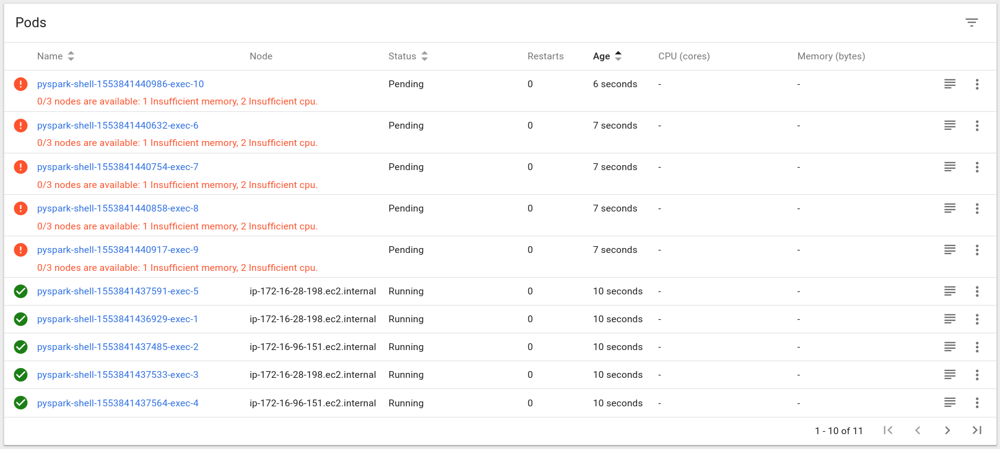

Don't panic!
Remember that we configured auto-scaling when creating the Kubernetes cluster.
Simply wait, for 10 minutes or so, for Kublr to create more nodes.

Here they are:

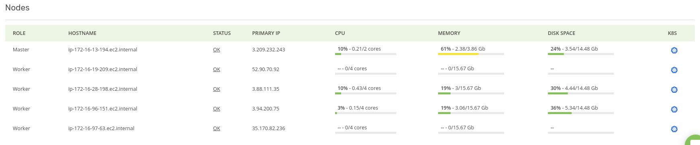

Finally, all pods are up and running.

Now let's delete them:

```python
sc.stop()
```

The extra nodes are not needed anymore, so Kublr can down-scale the cluster.
This also takes about 10 minutes.

## Sources

- [Getting Started with Spark on Kubernetes by Bernd Fondermann](http://blog.brainlounge.de/memoryleaks/getting-started-with-spark-on-kubernetes/)
- [HDFS on Kubernetes](https://github.com/apache-spark-on-k8s/kubernetes-HDFS)
